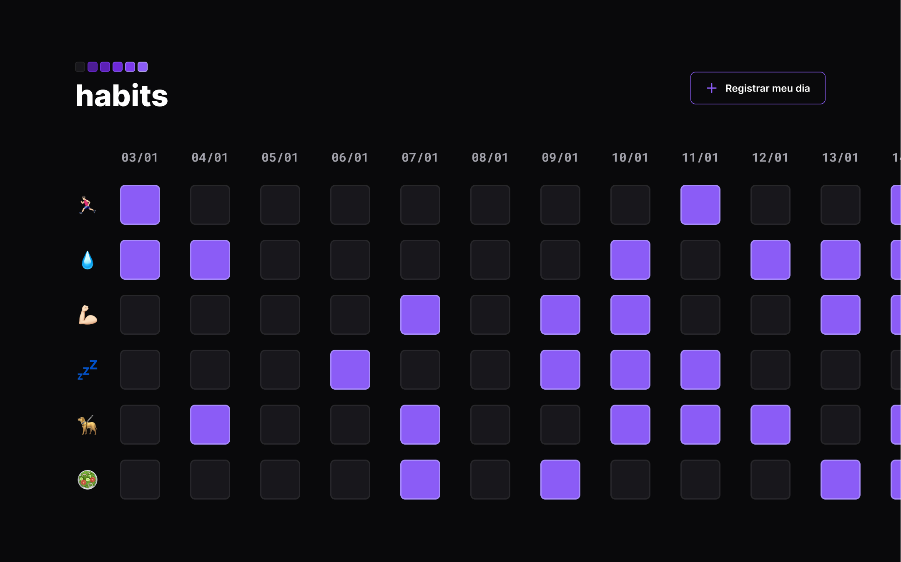

<h1 align="center"> NLW #11 SetUp </h1>

Evento exclusivo e gratuito, promovido pela Rocketseat para ensino de tecnologias WEB.

  <a href="#-tecnologias">Tecnologias</a>&nbsp;&nbsp;&nbsp;|&nbsp;&nbsp;&nbsp;
  <a href="#-projeto">Projeto</a>&nbsp;&nbsp;&nbsp;|&nbsp;&nbsp;&nbsp;
  <a href="#-layout">Layout</a>&nbsp;&nbsp;&nbsp;|&nbsp;&nbsp;&nbsp;
  <a href="#memo-licença">Licença</a>

  

 

  

## 🚀 Tecnologias

Esse projeto foi desenvolvido com as seguintes tecnologias:

- HTML e CSS
- JavaScript
- Git e Github

## 📚 Bibliotecas

- <a href="https://github.com/marcbruederlin/particles.js" target = "_blank">Particles.js</a>
- <a href="https://maykbrito.github.io/libs/NLWSetup/documentation/NLWSetup.html" target="_blank">NLW setup</a>

## 💻 Projeto

Ideia de mapeamento de habitos para melhorar a produtividade e qualidade de vida

## 🔖 Layout

Você pode visualizar o layout do projeto através [DESSE LINK](https://www.figma.com/file/fWsJOfybgrHzULgPJrF1sW/Habits-(e)-(Community)?node-id=75%3A128&t=vlX2HqTLRypEbaB1-0). É necessário ter conta no [Figma](https://figma.com) para acessá-lo.

## :memo: Licença

Esse projeto está sob a licença MIT.

---
Design Feito com ♥ by Rocketseat

 <h3 align="center"> Developed by <a href="https://www.linkedin.com/in/gabriel-santos-bb4a10188/">Gabriel Santos</a> ☕</h3>
